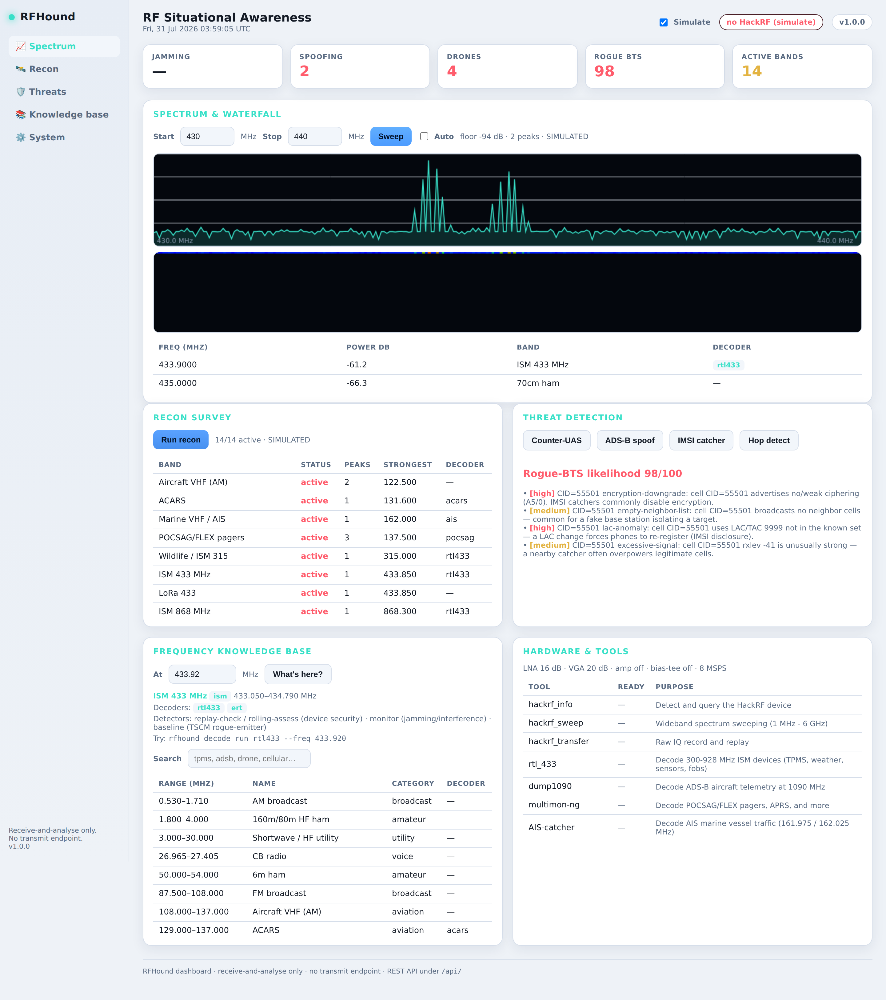

# RFHound 🐕‍🦺📡

**A friendly, powerful HackRF reconnaissance & RF situational-awareness toolkit.**
_Version 1.2 · receive-first · 243 tests · MIT._

RFHound turns a wall of raw spectrum into *"oh, that's a tire-pressure sensor"*.
It is an **orchestration layer** — it does not re-implement DSP. Instead it
drives the best existing tools (`hackrf_sweep`, `hackrf_transfer`, `rtl_433`,
`dump1090`, `multimon-ng`, `AIS-catcher`, and more) behind one guided,
approachable interface, and it ships a **frequency knowledge base** so you
always know what you're looking at.

> ⚠️ **Read [`docs/LEGAL.md`](docs/LEGAL.md) before you transmit anything.**
> RFHound is **receive-first**. Transmit is disabled by default and gated behind
> explicit authorization and a frequency allow-list. RFHound deliberately
> contains **no jamming, denial-of-service, deauth, or brute-force** capability.

---

## Web dashboard

A zero-dependency browser dashboard (live spectrum + waterfall, recon, threat
detection, knowledge base, hardware status) backed by a JSON REST API — the
integration surface for a SIEM / monitoring stack. **Receive-and-analyse only:
there is no transmit endpoint**, so exposing the dashboard never keys the radio.

```bash
rfhound web --open            # dashboard at http://127.0.0.1:8000
rfhound web --simulate        # demo it with no hardware
rfhound web --host 0.0.0.0 --token   # expose on a network, gated by a token
```

Bound to localhost by default; exposing it on a network auto-generates an API
token (or pass your own) so the REST API isn't open. Still receive-only.



## Why RFHound instead of the raw tools?

The RF security ecosystem already has excellent, focused tools. What's missing
is glue: something that surveys the spectrum, tells you *what* it found and *why
you'd care*, points you at the right decoder, and keeps you on the right side of
the law. That's RFHound.

| You want to… | RFHound gives you |
|---|---|
| Know what's on a frequency + every tool for it | `rfhound at 433.92` — band ID + decoders + detectors + commands |
| Find the frequency for a protocol | `rfhound tune adsb` → 1090 MHz |
| Guess what an unknown signal is | `rfhound classify 1090 --bw 1500` → ADS-B (92%) |
| Measure a recorded capture | `rfhound classify --file capture.sigmf-data` (bandwidth + modulation) |
| Save frequencies | `rfhound bookmark add myfob 433.92` |
| See what's transmitting around you | `rfhound recon` — auto-sweeps high-value bands and reports hits |
| Look at a specific slice of spectrum | `rfhound sweep 433 435` — terminal spectrogram + peak detection |
| Know what a frequency *is* | `rfhound bands --search tpms` — curated knowledge base |
| Decode a protocol | `rfhound decode run rtl433` — drives rtl_433 / dump1090 / … |
| Save a signal for deep analysis | `rfhound capture 433.92 10` — IQ + SigMF metadata for URH |
| Replay your *own* signal (authorized) | `rfhound replay file.sigmf-data --authorized` (gated) |
| **Detect** jamming / replay / weak fobs | `rfhound defense …` — detection & hardening, not attacks |
| Characterise/locate emitters (SIGINT/EW) | `rfhound sigint …` — ELINT pulse analysis, jamming type, emitter catalogue, RSSI + TDOA geolocation |
| **Detect** GNSS jamming / spoofing | `rfhound sigint gnss --file obs.json` — C/N0, AGC, position-jump & elevation checks (`--json` for SIEM) |

## Highlights

- **Runs with no hardware.** Every scan supports `--simulate`, so you can learn
  the workflow, demo it, and run the tests without a HackRF.
- **Friendly *and* scriptable.** Run `rfhound` bare for a guided menu, or use
  subcommands + JSON-friendly output for automation.
- **Graceful everywhere.** `rich` gives you colour/tables when installed; without
  it, RFHound falls back to clean plain text.
- **Safety by design.** Transmit is off by default, requires recorded consent and
  a per-frequency allow-list, and needs an explicit `--authorized` flag each time.
- **Knows the spectrum.** A curated 1 MHz–6 GHz band plan mapping frequencies →
  protocols → decoders → why a security researcher cares.

## Install

**One command** (creates a virtual environment and installs everything):

```bash
git clone https://github.com/jawaman14/rfhound.git
cd rfhound
./install.sh          # add --dev to include the test tools
rfhound setup         # one-time setup summary + next steps
```

Prefer to do it by hand (or on Windows)?

```bash
python3 -m venv .venv && source .venv/bin/activate
pip install -e .
```

New here? Follow the step-by-step **[tutorial](docs/TUTORIAL.md)** — it gets you
running in ~5 minutes, with or without a HackRF. `make help` lists handy tasks.

Then install the external SDR tools you want RFHound to drive (all optional —
`rfhound doctor` tells you what's present and how to get the rest):

```bash
# Debian/Ubuntu
sudo apt install hackrf rtl-433 multimon-ng
# dump1090-fa, AIS-catcher, acarsdec, dumpvdl2: see docs/USAGE.md
```

## 60-second tour

```bash
rfhound doctor                     # what's installed? is a HackRF attached?
rfhound bands --category ism       # browse the ISM bands (fobs, TPMS, IoT)
rfhound recon --simulate           # survey the spectrum (no hardware needed)
rfhound sweep 433 435              # spectrogram of the 433 MHz ISM band
rfhound decode run rtl433          # decode 433 MHz devices via rtl_433
rfhound capture 433.92 10          # record 10s of IQ for analysis in URH
rfhound                            # ...or just run the guided menu
```

Example recon output (simulated):

```
                      Recon survey [SIMULATED]
 Band          Category  Status  Peaks  Strongest              Decoder
 ISM 433 MHz   ism       active  1      433.850 MHz @ -62 dB   rtl433
 ISM 868 MHz   ism       active  1      868.300 MHz @ -58 dB   rtl433
 ADS-B (1090)  aviation  active  1      1090.00 MHz @ -55 dB   adsb
  Suggested next steps
  rfhound decode run rtl433 --freq 433.920   # ISM 433 MHz
  rfhound decode run adsb   --freq 1090.000  # ADS-B (1090ES)
```

## Defensive module — build protections, not attacks

RFHound's `defense` commands are the "harden your devices" half of the toolkit.
They are receive-and-analyse (plus the existing *gated* replay-of-your-own-signal
for the resilience harness). See [`docs/DEFENSE.md`](docs/DEFENSE.md).

```bash
rfhound defense monitor 433 435              # detect jamming / interference on a band
rfhound defense replay-check --file obs.txt  # detect replay attacks in observed traffic
rfhound defense rolling-assess --file caps.txt  # is this fob fixed- or rolling-code?
rfhound defense resilience --device myfob --replayed --actuated true  # hardening report

# RF intelligence / situational awareness (all receive-only)
rfhound defense baseline save 88 960 --out site.json   # TSCM known-good baseline
rfhound defense baseline diff site.json                # rogue / new emitters (bug sweep)
rfhound defense spoof-check adsb --file adsb.json       # ghost-aircraft / spoof detection
rfhound defense spoof-check ais  --file ais.json        # vessel-spoofing detection
rfhound defense drone-scan                              # counter-UAS band activity

# Extend it (bring-your-own bands / decoders / detectors)
rfhound mods sample && rfhound mods list
```

**What this module deliberately is not:** it contains no jammer/DoS transmitter,
no RollJam capture-and-replay attack, and no brute-force code generator. You
don't need those to build defenses — you detect jamming, you assess posture, and
you replay your *own* capture to prove replay-resilience. See
[`docs/LEGAL.md`](docs/LEGAL.md).

## What can you actually do across 1 MHz – 6 GHz?

See [`docs/FREQUENCIES.md`](docs/FREQUENCIES.md) for the full map. In short:
ISM 315/433/868/915 MHz (key fobs, TPMS, weather stations, IoT, smart meters),
ADS-B aircraft (1090 MHz), AIS ships (162 MHz), unencrypted pagers (POCSAG/FLEX),
ACARS/APRS, NOAA weather-satellite imagery, GPS L1 (receive-only), and the busy
2.4/5 GHz ISM bands.

## Documentation

- [`docs/HELP.md`](docs/HELP.md) — **full command reference** (start here)
- [`CHANGELOG.md`](CHANGELOG.md) — version history
- [`ROADMAP.md`](ROADMAP.md) — where the project is going (incl. TDOA geolocation)
- [`docs/LEGAL.md`](docs/LEGAL.md) — **read this first**; law, ethics, and what's excluded
- [`docs/USAGE.md`](docs/USAGE.md) — install the decoders, recipes, workflows
- [`docs/DECODERS.md`](docs/DECODERS.md) — the full decoder list + the signal auto-classifier
- [`docs/KNOWLEDGE_BASE.md`](docs/KNOWLEDGE_BASE.md) — RF reference: ITU bands, modulations, signal-ID workflow
- [`docs/REFERENCES.md`](docs/REFERENCES.md) — curated handbooks, guides, and tool links
- [`docs/DEFENSE.md`](docs/DEFENSE.md) — detection & hardening: jamming, replay, spoofing, TSCM, C-UAS, hop-detect, response playbooks
- [`docs/GNURADIO.md`](docs/GNURADIO.md) — prebuilt GNU Radio receive/analysis flowgraph presets
- [`docs/COPILOT.md`](docs/COPILOT.md) — drive RFHound with Claude / a local LLM (receive-only, safe)
- [`docs/MULTINODE.md`](docs/MULTINODE.md) — link multiple receivers/operators into one hub
- [`docs/AUTOMATION.md`](docs/AUTOMATION.md) — scheduled/looping RF tasks with triggers and alerting
- [`docs/RECORDINGS.md`](docs/RECORDINGS.md) — captures that store their classification + decode settings
- [`docs/SIGINT.md`](docs/SIGINT.md) — SIGINT/EW-support: ELINT pulse analysis, jamming characterisation, EOB, geolocation
- [`docs/THREATS.md`](docs/THREATS.md) — RF threat model & attack surface by band/encoding (defensive)
- [`docs/FREQUENCIES.md`](docs/FREQUENCIES.md) — the frequency knowledge base
- [`docs/MODDING.md`](docs/MODDING.md) — extend RFHound with your own bands/decoders/detectors
- [`docs/ARCHITECTURE.md`](docs/ARCHITECTURE.md) — how it's built and how to extend it

## Relationship to other tools

RFHound is complementary, not a replacement. For deep protocol reverse
engineering and fuzzing, [Universal Radio Hacker](https://github.com/jopohl/urh)
is best-in-class — RFHound produces URH/SigMF-compatible captures so you can hand
off seamlessly. `rtl_433`, `dump1090`, `multimon-ng`, `AIS-catcher` do the
decoding; RFHound orchestrates them and adds the knowledge base + safety layer.

## License

MIT — see the repository `LICENSE`.
